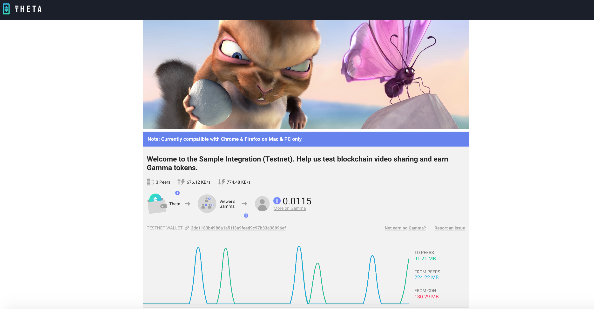

# Livestream Integration Example

This folder contains an example which demonstrates how to integrate the Theta Mesh Delivery Javascript Library into a livestreaming website. 

To run this demo, simply download this repository, and double click on the *index.hmtl* page in this folder. As shown in the screenshot below, the page should contain the Theta player and a traffic composition chart, which displays the amount of data transferred to and from peer nodes. The page also shows the amount Gamma tokens earned for bandwith sharing. You can load the *index.html* page on multiple browser tabs to see the bandwidth sharing in action.

